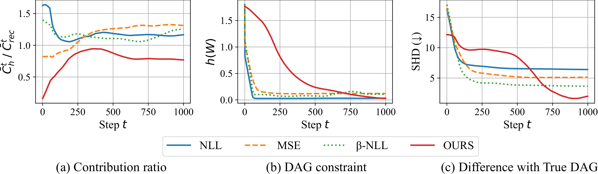
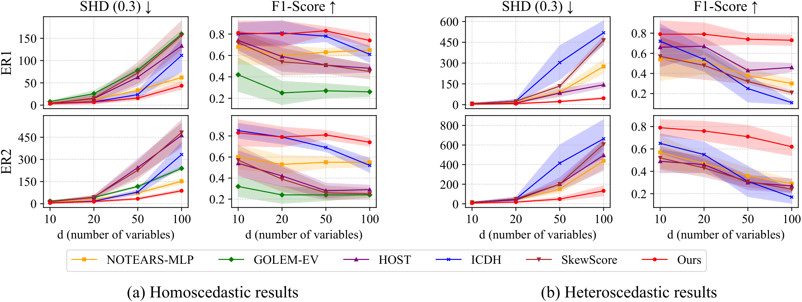

<h1 align="center">Stabilizing Causal Structure Learning under Heteroscedasticity</h1>

<h4 align="center">Analysis and Mitigation of Optimization Failures</h4>

<p align="center">
  ✨ <a href="https://kdd2026.kdd.org/"><strong>KDD 2026</strong></a> ✨
</p>

<p align="center">
  <strong>Eunjung Choi<sup>†</sup> · Seonggyeom Kim<sup>†</sup> · Dong-Kyu Chae<sup>*</sup></strong>
  <br>
  <a href="https://dilab.hanyang.ac.kr/">Data Intelligence Lab</a>, Hanyang University
  <br>
  <sup>†</sup>Equal contribution    <sup>*</sup>Corresponding author
  <br><br>
  <a href="main_paper.pdf"><strong>Main Paper</strong></a> ·
  <a href="Supplementary_Material.pdf"><strong>Supplementary Material</strong></a> ·
  <strong>Poster (TBD)</strong>
</p>

## Overview

Heteroscedastic noise can destabilize likelihood-based causal structure learning by producing unreliable optimization dynamics. This repository implements a scheduling strategy that begins with stabilizing mean and variance objectives, then transitions toward the heteroscedastic negative log-likelihood used for structure estimation.

- **Optimization analysis:** studies failure modes caused by jointly learning causal mechanisms and input-dependent noise.
- **Scheduled mitigation:** gradually decays the stabilizing objective before switching to heteroscedastic likelihood optimization.
- **Reproducible evaluation:** includes nonlinear SEM generation, multi-seed experiments, and standard causal discovery metrics.

## 🔍 Failure Analysis

Standard objectives rapidly satisfy the DAG constraint, but this early convergence does not necessarily produce an accurate causal graph. As shown below, NLL, MSE, and β-NLL quickly drive `h(W)` toward zero while their structural error plateaus. Our scheduling strategy maintains a more balanced optimization trajectory and continues reducing SHD.

<p align="center">
  
</p>

<p align="center">
  <sub><b>Figure 1.</b> Optimization dynamics of standard objectives and our stabilization strategy: contribution ratio, DAG constraint, and difference from the true DAG.</sub>
</p>

## 💡 Stabilization Strategy

To mitigate the optimization failure above, the method begins with stabilizing mean and variance objectives and progressively transitions toward heteroscedastic negative log-likelihood optimization. The scheduling coefficient follows

$$
\lambda_{\mathrm{reg}}(t) = \lambda_{\mathrm{reg}}(0) \exp\left(-\frac{t}{t^*/\tau}\right)
$$

where `λ_reg(0)` is the initial scheduling weight, `t*` is the transition step, and `τ` controls the decay rate.

## 📊 Main Results

Across both homoscedastic and heteroscedastic settings, our method remains robust as the number of variables increases. The improvement is especially pronounced under heteroscedasticity, where it achieves substantially lower SHD while maintaining a consistently high F1-score.

<p align="center">
  
</p>

<p align="center">
  <sub><b>Figure 2.</b> Main results on ER1 and ER2 graphs as the number of variables increases. Shaded bands indicate variability across runs.</sub>
</p>

## ⚙️ Environment Setup

The reference environment uses Python 3.9 and the package versions below.

```bash
conda create -n hnm python=3.9 -y
conda activate hnm

pip install numpy==2.0.1 \
            scipy==1.13.1 \
            torch==2.4.0 \
            scikit-learn==1.6.1 \
            python-igraph
```

Clone the repository:

```bash
git clone https://github.com/Sinegi/HNM.git
cd HNM
```

## 🚀 Quick Start

### 1. Use the provided synthetic data

The archive contains heteroscedastic nonlinear datasets for multiple graph sizes and random seeds.

```bash
unzip hetero_dataset.zip

python main.py \
  --data_type hetero_nonlinear \
  --s0 1 \
  --num_size 10 \
  --random_seed 0 \
  --tau 5 \
  --max 1000 \
  --init 100
```

### 2. Generate a new dataset

```bash
python data_generation.py \
  --num_size 5 \
  --s0 2 \
  --sem mlp \
  --graph_type ER \
  --sample_size 1000 \
  --data_type hetero_nonlinear \
  --random_seed 0
```

Run the method with the matching dataset configuration:

```bash
python main.py \
  --num_size 5 \
  --s0 2 \
  --data_type hetero_nonlinear \
  --random_seed 0 \
  --tau 5 \
  --max 1000 \
  --init 100
```

Results are appended to `results/er{s0}n{num_size}.txt` and report FDR, TPR, FPR, SHD, and the number of predicted edges.

### 3. Run the included benchmark sweep

After extracting `hetero_dataset.zip`, the shell script evaluates 10 random seeds for ER1 graphs with 10 and 20 variables:

```bash
bash run.sh
```

## Main Arguments

### Optimization

| Argument    | Description                   |  Default |
| ----------- | ----------------------------- | -------: |
| `--tau`   | Decay-rate parameter`τ`    |    `5` |
| `--max`   | Transition step`t*`         | `1000` |
| `--init`  | Initial weight`λ_reg(0)`   |  `100` |
| `--lamb1` | L1 regularization coefficient | `0.01` |
| `--lamb2` | L2 regularization coefficient | `0.01` |

### Data and graph

| Argument          | Description                                 |              Default |
| ----------------- | ------------------------------------------- | -------------------: |
| `--sample_size` | Number of generated samples                 |             `1000` |
| `--num_size`    | Number of variables                         |               `10` |
| `--s0`          | Graph degree parameter                      |                `1` |
| `--graph_type`  | Graph family:`ER` or `SF`               |               `ER` |
| `--sem`         | Structural equation model:`mlp` or `gp` |              `mlp` |
| `--data_type`   | Noise/data setting used by the learner      | `hetero_nonlinear` |
| `--random_seed` | Random seed                                 |                `0` |

## Citation

If you find this work useful, please cite:

```bibtex
@inproceedings{choi2026stabilizing,
  title     = {Stabilizing Causal Structure Learning under Heteroscedasticity:
               Analysis and Mitigation of Optimization Failures},
  author    = {Choi, Eunjung and Kim, Seonggyeom and Chae, Dong-Kyu},
  booktitle = {Proceedings of the 32nd ACM SIGKDD Conference on
               Knowledge Discovery and Data Mining},
  year      = {2026}
}
```

## Acknowledgements

This implementation builds on ideas and utilities from continuous optimization approaches to nonlinear DAG learning, including [NOTEARS](https://github.com/xunzheng/notears).

## License

This project is released under the [MIT License](LICENSE.txt).
